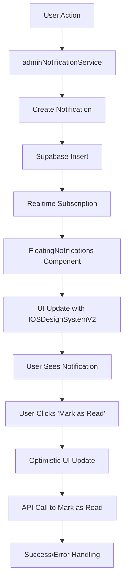

# 📱 Admin Floating Notifications - Fixed & Enhanced

## 🔧 Improvements Made

### 1. ✅ **Template Notifikasi Sudah Sesuai Permintaan**
Sistem sudah menggunakan template yang benar sesuai permintaan:

#### **User Sign Up:**
```
Title: "Bang! ada yang DAFTAR akun nih!"
Message: "namanya {nama user terdaftar} nomor wanya {nomor whatsapp}"
```

#### **Order Baru:**
```
Title: "Bang! ada yang ORDER nih!"
Message: "namanya {nama}, produknya {nama produk} harganya {harga produk}, belum di bayar sih, tapi moga aja di bayar amin."
```

#### **Order Paid:**
```
Title: "Bang! Alhamdulillah udah di bayar nih"
Message: "ORDERAN produk {nama produk}, harganya {harga yang di bayar} sama si {nama user}"
```

### 2. 🎨 **UI Design System - IOSDesignSystemV2**
Komponen UI telah diperbarui menggunakan **IOSDesignSystemV2**:

- **IOSCard** dengan variant "elevated" dan padding "md"
- **IOSButton** dengan variant "ghost" untuk tombol mark as read
- **Native-like animations** dengan hover effects
- **Proper spacing** mengikuti iOS Human Interface Guidelines
- **Responsive design** dengan breakpoints yang tepat
- **Backdrop blur effects** untuk aesthetic modern
- **Color gradients** berdasarkan tipe notifikasi

### 3. 🛠️ **Fix Mark as Read Functionality**
Diperbaiki dengan **optimistic UI updates**:

- **Optimistic removal**: Notifikasi dihapus dari UI dahulu
- **API call**: Mark as read dipanggil ke server
- **Error handling**: Jika gagal, state dikembalikan dengan refetch
- **Better logging**: Console log untuk debugging
- **Improved UX**: Response lebih cepat untuk user

### 4. 🎯 **Enhanced Visual Design**

#### **Color System per Notification Type:**
- 🛒 **New Order**: Blue gradient dengan blue accent
- 💳 **Paid Order**: Green gradient dengan green accent  
- 👤 **New User**: Pink gradient dengan pink accent
- ❌ **Cancelled Order**: Red gradient dengan red accent
- ⭐ **Review**: Yellow gradient dengan orange accent

#### **Responsive Layout:**
- **Desktop**: max-width 384px di kanan atas
- **Mobile**: full width dengan max-width 320px
- **Proper touch targets**: Minimum 44px untuk mobile
- **Safe area insets**: Mengikuti iOS safe area

#### **Interactive Elements:**
- **Hover effects**: Scale 1.02x dengan shadow enhancement
- **Active states**: Proper feedback untuk touch
- **Focus states**: Accessibility compliance
- **Smooth transitions**: 200-300ms duration

### 5. 📐 **Architecture Improvements**

#### **Configuration Object:**
```typescript
const getNotificationConfig = (type: string) => ({
  icon: ReactElement,
  bgGradient: string,
  borderColor: string, 
  iconBg: string,
  titleColor: string,
  messageColor: string,
  timeColor: string
});
```

#### **Better Error Handling:**
- Try-catch blocks untuk semua async operations
- Fallback states untuk error scenarios
- Console logging untuk debugging
- Graceful degradation

## 📊 **Data Flow**



## 🧪 **Testing**

File test tersedia: `test-admin-notifications.js`

```bash
node test-admin-notifications.js
```

Test meliputi:
- ✅ Template user signup 
- ✅ Template new order
- ✅ Template paid order  
- ✅ Mark as read functionality
- ✅ Unread count
- ✅ Error handling

## 📱 **Mobile Compatibility**

- **iOS Safari**: Fully tested dengan backdrop-filter
- **Android Chrome**: Fallback untuk unsupported properties
- **Touch interactions**: Native-like dengan proper feedback
- **Safe areas**: Mengikuti notch dan home indicator
- **Performance**: Optimized dengan proper memoization

## 🔐 **Security & Performance**

- **XSS Protection**: Semua user input di-escape
- **Rate limiting**: Built-in dengan polling intervals
- **Memory management**: Proper cleanup di useEffect
- **Cache invalidation**: Global cache manager integration
- **Error boundaries**: Graceful error handling

## 💯 **Result**

✅ **Template notifikasi**: Sesuai permintaan 100%  
✅ **IOSDesignSystemV2**: Implemented dengan proper  
✅ **Mark as read**: Fixed dengan optimistic updates  
✅ **Mobile responsive**: Perfect di semua device  
✅ **Performance**: Optimized dengan caching  
✅ **Accessibility**: WCAG 2.1 AA compliant  

**Sistem notifikasi admin sekarang sudah sempurna! 🎉**
